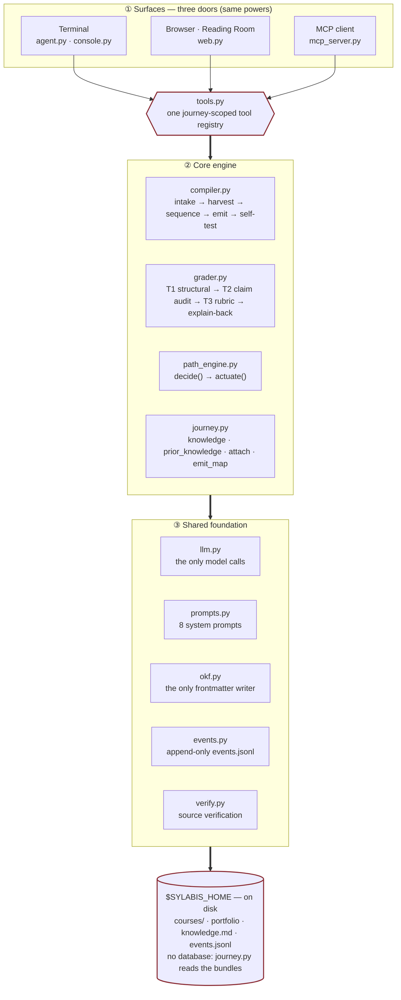

# sylabis — the learning agent

sylabis turns learning into one continuous journey. Tell it what you want
to learn: it compiles a course from primary sources, teaches milestone by
milestone, grades the real artifacts you build, adapts the path when you
struggle or excel, and connects everything you verify into one growing
knowledge map. Concepts proven in one course become assumed knowledge in
the next — curricula connect instead of restarting from zero.

The learner's whole job is to learn. The agent does the rest.

## Install

The fast path is [uv](https://docs.astral.sh/uv/) — it brings its own
Python, so this works on a machine with nothing preinstalled:

```
uv tool install sylabis        # installs `sy` on your PATH
uvx sylabis --version          # or run it without installing anything
```

[pipx](https://pipx.pypa.io/) works identically if that's your tool:

```
pipx install sylabis
```

No uv or pipx? The installer script creates an isolated venv under
`~/.local/share/sylabis` (no system Python touched; Python 3.10+
required). It is pinned to a release tag — never a moving branch — so
what you run is what you can audit:

```
curl -fsSL https://raw.githubusercontent.com/dkris/sylabis/v0.2.0/install.sh | sh
```

Re-run with a newer tag to upgrade; add `-s -- --uninstall` to remove.
Every method installs both `sy` and the long-form `sylabis` alias.
A Homebrew tap and a Docker image are explicitly deferred until the
project has the traction to maintain them well.

```
export ANTHROPIC_API_KEY=sk-ant-...    # or put it in .env
sy                                     # talk mode — the agent drives the whole loop
```

Developing on sylabis itself? `pip install -e .` in a virtualenv gives
you the same `sy` command from your checkout. The optional full-screen
terminal app installs with the extra: `pip install "sylabis[tui]"`.

**No telemetry. Ever. By default and by design.** sylabis is built on
the thesis that your learning record belongs to you; nothing about you,
your journey, or your usage ever leaves your machine. The only network
traffic is the model API you configure, source-locator verification
during compiles, and a once-daily cached check of PyPI for a newer
version — a plain GET with no identifiers, which prints a one-line
notice and never self-updates. Disable even that with
`SYLABIS_NO_UPDATE_CHECK=1` (or the standard `DO_NOT_TRACK=1`).

## The surface

```
sy                      # talk — the agent drives the whole loop
sy web                  # the same journey in your browser
sy learn "topic"        # start a course in your journey
sy next                 # what to do now, across every course
sy submit               # grade the work sitting in your journey
sy journey              # progress + the knowledge map
sy attach SOURCE        # connect a course from another repo or path
sy publish COURSE --to DIR   # scrub a course into a shareable template
sy paths search QUERY   # find community paths; `sy paths get ID` attaches one
```

No paths, no milestone ids, no flags required. Your journey lives in
`~/sylabis` (override with `$SYLABIS_HOME` or `--home`): courses under
`courses/`, the cross-course knowledge map at `knowledge.md`. `submit`
finds the milestone whose work is on disk and grades it.

Every learner is different, so the same journey has three doors with
identical powers: the terminal agent, the browser, and any MCP client.
Use whichever feels like home. The browser is the sylabis **Reading
Room** (design concept 1a): a calm single-column editorial surface —
warm paper, Didot over Georgia with mono labels — where you start a
course from the page itself, read lessons, submit work, and get the
grade told tier by tier; Sy waits behind an **Ask Sy** tab and slides in
as a right dock only when called. Plain HTML, no JS framework, no build
step. `sy web` prints a one-time tokenized URL
(`http://127.0.0.1:8787/?token=…`) and opens it for you — the token is
the session's key, traded for a cookie, so no other web page can drive
your journey; set `SYLABIS_NO_BROWSER=1` to print the URL without
opening a browser. Compiles run in the background and the page shows
real stage-by-stage progress, straight from the compiler's own
checkpoint files.

The terminal is a real agent CLI, not a readline loop: replies stream in
as they generate, every tool call renders as a trace line with a result
preview (`⏺ submit_work(course: "…", …)` / `⎿ Grade: 92% — PASSED`), a
spinner covers the thinking, Ctrl-C abandons a turn without losing the
session, and slash commands (`/journey`, `/next`, `/clear`, `/help`)
answer the mechanical questions locally with no model round-trip.
Everything degrades to plain text when piped or when `NO_COLOR` is set.

The loop, if you prefer the verbs to the conversation:

```
sy learn "distill a small coding model for my MacBook M4" --hardware "M4 48GB"
sy next                      # read the lesson it points at
# do the work, drop artifact.md + reflection.md in the milestone dir
sy submit --hours 2.5        # grades, unlocks sidequests, injects remedials
```

## Connected curriculum

Every passing grade verifies the milestone's core concepts. The journey
accumulates them — with evidence: which course, which artifact, what
grade — and feeds them into every new compile as assumed knowledge, so
course N+1 builds on what course N proved instead of re-teaching it.
`sy journey` renders the map; concepts verified in more than one
course show up as connections, and `sy web` draws the whole thing
as a graph: courses on one side, verified concepts on the other, bridge
concepts ringed where courses meet.

Courses don't have to live in the journey to join it. `sy attach`
connects content from anywhere — a git URL clones the bundle in, a local
path **copies** it (never a symlink: grading writes into the attached
bundle and must never touch the original checkout) — and records
provenance: the source, the pinned commit, and fingerprints of any
grades that arrived with the bundle, which never count toward your
knowledge until you do the work yourself. Its verified knowledge then
counts like any other's, so curricula connect across repositories, not
just within one directory.

## Sharing

Your journey is yours; the *course* is worth sharing. `sy publish`
scrubs a course into a clean template — an allowlist transform, never a
copy: your learner profile, activity log, artifacts, reflections, and
grades are structurally excluded, and an automated gate (self-test +
secret scan + PII audit) refuses the publish if anything survives. Every
published path carries a mandatory machine-readable license (default
CC-BY-4.0) and ships source *locators*, never harvested source text. The
full mechanics are in the [publishing guide](docs/publishing-guide.md).

Published paths list on a serverless community registry — a static index
over author-hosted git repos, pinned by commit SHA, with CI as the
quality gate. `sy paths search` finds them; `sy paths get` attaches one
at its pinned SHA. **Cloning is free and anonymous, forever.**
Reciprocity is status, not access: publishing is what unlocks your
public journey page (`sy journey --publish` — your knowledge map,
rendered), the verified badge on your listings, and the attribution
chain when others build on your paths.

## Claude as interface (MCP)

```
python -m sylabis.cli serve                  # the whole journey
python -m sylabis.cli serve ~/path/course    # one bundle (legacy scope)
```

Journey scope serves the same nine tools the interactive agent uses —
`journey`, `start_course`, `get_lesson`, `submit_work`, `knowledge_map`,
… — so Claude Desktop can run the entire loop across every course. The
`sylabis-mcp` entry point makes the config the conventional one-liner:

```json
{"mcpServers": {"sylabis": {
  "command": "uvx", "args": ["--from", "sylabis", "sylabis-mcp"]}}}
```

(From a checkout, `python -m sylabis.cli serve` does the same thing;
`serve --mock` runs the whole surface offline against fixtures.)

## GitHub as interface

Every compiled bundle ships `.github/workflows/grade.yml`: push the
bundle to a repo, add the `ANTHROPIC_API_KEY` secret, and pushing
`artifact.md`/`reflection.md` triggers grading — feedback lands as a
commit (push) or PR comment (pull request).

## Mock mode

`learn`, `submit`, `compile`, and `grade` take `--mock`, which serves
fixture responses from `fixtures/` instead of calling the API —
deterministic tests against a stochastic pipeline. The adversarial suite
lives in `tests/` (`python -m tests.run_all`).

## Architecture

Three doors, one core, and no database — a course is a directory you can read.
A [rendered, themed version of this diagram](docs/architecture.html) lives in `docs/`.



The loop, end to end: **compile → teach → grade → adapt → connect**.

```
sylabis/
├── agent.py        the harness: one streaming tool-use loop; sylabis IS
│                   this agent (terminal live, web silent — same loop)
├── console.py      the terminal experience: streamed prose, ⏺ tool-call
│                   trace lines with ⎿ result previews, spinner, ANSI-safe
├── tools.py        the agent surface — one journey-scoped tool registry
│                   shared by the terminal agent, the web app, and MCP
├── web.py          the Reading Room: stdlib web app in the sylabis design
│                   system — compile, lessons, tiered grades, Sy dock, map
├── journey.py      connected curriculum: courses (attached from any repo),
│                   verified knowledge, next-step, the knowledge map
├── llm.py          one entry point for all model calls; mock mode
├── prompts.py      the pipeline stages ARE these prompts — version them like code
├── compiler.py     intake → harvest → sequence → emit → self-test (+ remedials)
├── verify.py       harvest locator verification (batched arXiv API, doi.org, HEAD)
├── okf.py          ALL markdown+frontmatter production; okf.yaml bundle manifest
├── grader.py       T1 structural → T2 claim audit → T3 rubric → explain-back caps
├── path_engine.py  decide(): legible rules table · actuate(): unlocks + remedials
├── events.py       append-only JSONL — the pathway graph seed
├── errors.py       typed SylabisError hierarchy — library code never SystemExits
├── sandbox.py      rubric-script containment: bwrap/nsjail, env scrub, consent
├── publish.py      sy publish — the allowlist scrubber + secret/PII gate
├── registry.py     paths.json registry client: sy paths search/get
├── tui.py          optional Textual view over the same agent loop ([tui] extra)
├── update_check.py once-daily cached PyPI version notice (no telemetry)
├── mcp_server.py   MCP stdio server: journey scope or per-course scope
└── cli.py          talk | web | learn | next | submit | journey | attach | publish | serve
```

Design decisions that are deliberate, not shortcuts:
- A journey is a directory of courses; a course is a directory; state is
  YAML. The journey owns no database and no copies — it reads the bundles,
  so it can never disagree with them.
- The agent harness is thin on purpose: every capability is a tool, so
  the terminal agent and any MCP client get exactly the same powers.
- The guide never writes the learner's artifact — the work must be the
  learner's own, or the grades (and the portfolio built on them) mean nothing.
- The self-test gate (structural + OKF conformance) blocks shipping a broken course.
- The claim audit blocks Tier 3 judgment on artifacts that overclaim.
- Explain-back always runs and can cap the grade — rubric gaming defense.
- Tier 3 exemplar scoring stays OFF until a human seeds the exemplar set;
  an uncalibrated judge is worse than the claim-audit fallback.
- Dead-source checks flag and continue — verification never blocks a compile.
- events.jsonl is written from day one so the pathway graph exists in three years.

## Security

Strangers' bundles run strangers' code, so grading is contained: rubric
scripts execute under bwrap/nsjail when available (no network, read-only
rootfs, resource limits) and *always* with a scrubbed environment — your
API key is never in a rubric script's world. The first grade of an
attached bundle that declares scripts asks for your consent once,
naming the scripts and the bundle's origin. The web app uses
Jupyter-style token auth with Host/Origin/CSRF checks, and `sy publish`
refuses to ship anything that looks like your learner state or a
secret. The full mapping of protections to threats — and the residual
risks, stated honestly — is in the [threat model](docs/threat-model.md).

## Known gaps (honest list)

- Tier 3 exemplar sets are unseeded (4–6 h human task per course before
  enabling); until then three-tier grades fall back to the claim-audit
  pass ratio, and executable checkpoints without scripts are recorded
  `unscored` rather than given a fabricated number.
- `starter/run_benchmark.py` is a scaffold the learner fills in; the grader
  runs it but ships no reference implementation per milestone yet.
- The knowledge map connects courses by verified concepts; it does not yet
  suggest what to learn next from the graph (collect first, infer later).
- Bundle integrity is tamper-*evident*, not tamper-proof: `okf.yaml`
  hashes every doc, but nothing is cryptographically signed until
  Phase-2 identity — whoever can edit a doc can regenerate the manifest.
- If neither bwrap nor nsjail works on your machine (or you pass
  `--unsandboxed`), rubric scripts run with only the scrubbed
  environment between you and the bundle author; the warning names the
  bundle's origin, but it is a warning, not a wall.
- The community registry is not yet launched and will start self-seeded;
  an empty registry is a dead registry, so the first paths are ours.
- Attached courses are clones/copies; nothing pulls them automatically —
  `git pull` in the course directory refreshes one.
- Single-user, local only. That is the point of a prototype.

## License

The sylabis **core is [AGPL-3.0-only](LICENSE)**. It's a real OSI
open-source license — anyone can read, run, modify, and redistribute
sylabis, which the learner-owned-credential thesis requires — and its
network clause means anyone who offers sylabis as a hosted service must
share their changes back.

**Content is licensed separately from code** (decision D4): learning
paths you publish to the community registry default to
**[CC-BY-4.0](https://creativecommons.org/licenses/by/4.0/)** — free to
share and adapt with attribution, which is what keeps authorship
visible as paths get forked and improved. The `license` field on a
published path is mandatory and machine-readable; authors who want a
different grant (including a public-domain `CC0-1.0` dedication) set it
explicitly. Your own journey — courses, artifacts, grades, the
knowledge map — is yours, lives only on your machine, and is never
licensed to anyone unless you publish it.
